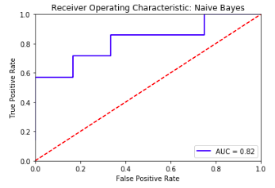
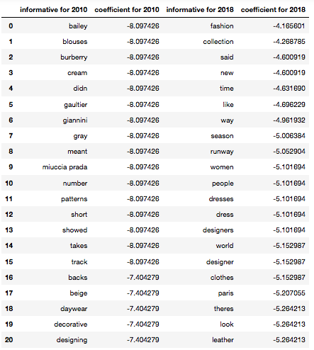
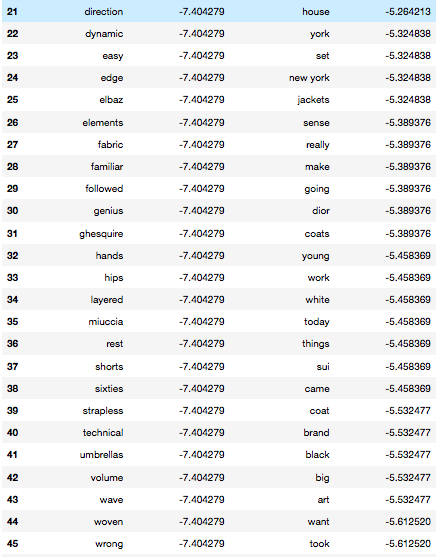

[Link to blog post](https://medium.com/@idontneedtoseethat/anything-but-natural-barthes-and-nlp-42573db5a5ff)

## Anything But Natural: Barthes and NLP

Here’s Roland Barthes in The Fashion System (Système de la mode, 1967):

“In order to blunt the buyer’s calculating consciousness, a veil must be drawn around the object [i.e. the clothes] — a veil of images, of reasons, of meanings … it is not the object but the name that creates desire … if the magazine describes a certain article of clothing verbally, it does solely to convey a message whose content is: Fashion.”

Barthes’s project used photo captions from fashion magazines as more mass-culture fodder for his investigations of semiotics (social diffusion of meaning), ongoing since the 1950s. In the book he elaborates a kind of grammar/rhetoric/inventory of the “vestimentary code” in his signature learned-but-playful style — for example noting the excess (two signifiers and two signifieds!) of “striped flannel or polka-dot twill, depending on whether for morning or evening.”

This was not a computational NLP (natural-language processing) analysis, but it stemmed from the same field: corpus linguistics, which was a relatively new term in 1957–1963, when Barthes was writing The Fashion System. Barthes explicitly called his pile of magazines a corpus and limited himself to working only with this set of artifacts. In the 1930s-1960s, structuralists like Barthes, inspired by the earlier work of linguist Ferdinand de Saussure, defined, collected and worked on corpora in various fields, looking for the patterns that produce meaning just as in NLP as practiced decades later. The history section of the NLP Wikipedia page emphasizes the computer-science roots of NLP (the dream of artificial intelligence and machine translation in the 1940s and 1950s and so on), but the methodology (if not the technology) of NLP was also pioneered in the humanities.

In light of the above, I decided to see whether I could further Barthes agenda in a small way with respect to “written clothes.” The corpus I chose was Vogue Runway’s capsule reviews of high-fashion shows, written by reporters who attend them. Coverage is pretty exhaustive and goes back 10–20 years: several dozen collections per season (including in-between ones like pre-fall and resort) across several capitals (chiefly Milan, Paris, London and New York).
I started with a small sample (about 75 reveiws) drawn from spring and fall ready-to-wear seasons in 2018 and 2010, training Naive-Bayes classifiers (assuming multinomial distribution of word counts in tokenized articles) solely on the reviews’ body text. In distinguishing between 2010 and 2018 as labels, accuracy hovered around 75% with 500 or 1000 features (unigrams and bigrams). Surprisingly, the models at this scale were generally not capable of distinguishing between spring and fall collections, getting it right about half the time. They guessed the exact-right season about 15% of the time, but all of these metrics could improve further as more articles are added. Receiver operating characteristic (ROC) curves (see below) confirm that these results are not likely to be due to chance.



The most informative words are listed below, and the Python code below that. In general, in the last eight years, fashion writing has become more purely self-referential: in 2018, we have “fashion,” “collection,” “season,” “runway”, “designer,” “house,” “set” (as in runway as stage set) and “look” as important terms. Recent fashion has also become more focused on non-garment-related ideas about society at large and economics (“time,” “women,” “people,” “world,” “brand,” “young,” “art,” “work”) as well as place (“York,” “Paris”).

Back in 2010, the emphasis was more on specific designers (Nicolas Ghesquière at Balenciaga, Christopher Bailey at Burberry, John-Paul Gaultier at Hermès, Frida Giannini at Gucci, Miuccia Prada at Prada, Alber Elbaz at Lanvin), articles of clothing (“blouses,” “daywear,” “shorts,” “umbrellas”), colors (“cream,” “gray,” “beige”), fabrication (“fabric,” “patterns,” “layered,” “woven,” “technical,” “volume”) and the body (“short,” “backs,” “hands,” “hips”) . Even the more abstract terms from 2010 were more emotional/aspirational rather than cold/generic: “decorative,” “easy,” “dynamic,” “familiar,” “genius” vs. 2018’s “like,” “way,” “going,” “want” and “sense.”

The few items from 2018 that indicate concrete trends in a trendless market seem to be “dresses,” “leather,” “jackets,” “coats,” “white” and “black.” Reference to particular decades (“sixties”) seem to be out of fashion. Neutrals have sharpened up but still have the edge against color — unless this is a cyclical phenomenon, which could be investigated by expanding the data set. Finally, my own two cents: I would anticipate a swing, already underway at some houses, back to aesthetics and craft.





``` python
bow = CountVectorizer(stop_words = ‘english’, preprocessor = clean_article, tokenizer = TweetTokenizer().tokenize,
 ngram_range=(1,2), max_features = 500, max_df = 1.0, min_df = 1, binary = False)
training_data = bow.fit_transform(xtrain.text)
test_data = bow.transform(xtest.text)
dftrain = pd.DataFrame(training_data.toarray())
dftrain.columns = bow.get_feature_names()
dftest = pd.DataFrame(test_data.toarray())
dftest.columns = bow.get_feature_names()
clf = MultinomialNB()
model = clf.fit(dftrain, ytrain)
preds = model.predict(dftest)
accuracy = accuracy_score(ytest, preds)
feature_names = np.array(list(dftrain.columns.values))
n=50
coefs_with_fns = sorted(zip(model.coef_[0], feature_names))
top = list(zip(coefs_with_fns[:n], coefs_with_fns[:-(n + 1):-1]))
table1 = pd.DataFrame(columns=['informative for 2010', 'coefficient for 2010', 'informative for 2018', 'coefficient for 2018'])
for i in top:
     table1 = table1.append({'informative for 2010': i[0][1],
     'coefficient for 2010': i[0][0], 'informative for 2018':
     i[1][1], 'coefficient for 2018': i[1][0]}, ignore_index=True)
probas = model.predict_log_proba(dftest)
fpr, tpr, threshold = roc_curve(ytest, probas[:,1])  
roc_auc = auc(fpr, tpr)
plt.title('Receiver Operating Characteristic: Naive Bayes')
plt.plot(fpr, tpr, 'b', label = 'AUC = %0.2f' % roc_auc2)
plt.legend(loc = 'lower right')
plt.plot([0, 1], [0, 1],'r--')
plt.xlim([0, 1])
plt.ylim([0, 1])
plt.ylabel('True Positive Rate')
plt.xlabel('False Positive Rate')
plt.show()
```
